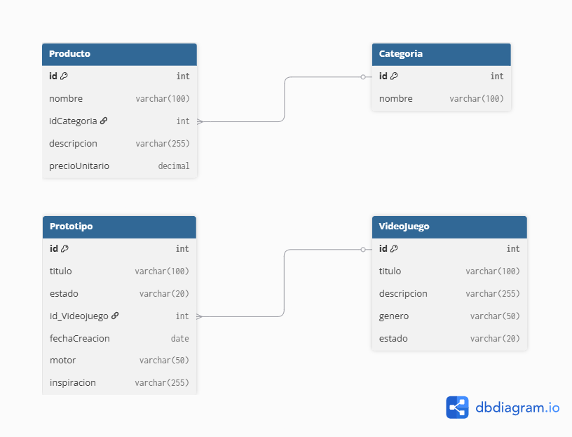

# Geek Inventory API

API REST desarrollada con **Node.js + Express** que combina dos mundos: la gestión de inventario de un emprendimiento familiar y el backlog personal de videojuegos y prototipos de desarrollo.

## Módulos

### Inventario
Gestión de productos y categorías para un emprendimiento. Permite organizar el stock por categoría, registrar precios y controlar cantidades.

**Entidades:** `Categoria` → `Producto`

### Backlog
Lista personal de videojuegos con seguimiento de estado (pendiente, jugando, completado) y registro de prototipos de juegos propios con su inspiración.

**Entidades:** `Videojuego` → `Prototipo`

## Tecnologías

- Node.js
- Express
- Sequelize (ORM)
- SQL Server (SSMS)
- Docker

## Modelo de base de datos

## Estado

> Proyecto en desarrollo activo.

---

*Proyecto de portfolio — [@GiuliJauAym](https://github.com/GiuliJauAym)*
